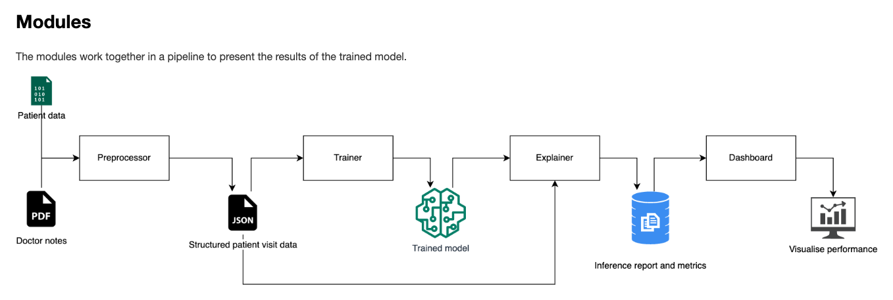

# Scalable

## Splitting processes
One strategy is to split processes, in order to parallelize them.
Let's take the document parser as an example: the first question is, do you expect 1000 files? 10.000? or 100.000?

Maybe this project you expect 10.000 files, but will your code break when the amount grows to 100.000?

At this point, you will need to consider the time it takes to process something. Processing a single file takes about 2 seconds. That means that 10.000 files will take 5.5 hours, and 100.000 files will take 55 hours.



Consider again this pipeline. Here, we already considered that the preprocessing might take a lot of time. Why? Because the preprocessor is a separate module, with it's own `pyproject.toml` file, etc.
It is designed in order to run on a VM, separate from the Trainer and the Explainer.

Because it is easy to create a standalone Preprocessor, it is also pretty easy to spin up 10 machines with 10 Preprocessors. The only thing we will have to manage now is that every preprocessor consumes another part of the data. When it's just 10 VMs, it might be the most straightforward to simple split the directory of files into 10 parts. If things get more complex, you could also use [ray data](https://docs.ray.io/en/latest/data/overview.html) to distribute your dataset over a cluster of machines.

## Speeding up
Another strategy would be to speed things up.
In this project, for the Trainer we plan on using a GPU. The downside of using a GPU is that the price of a GPU is much higher (compare our VMs cost $0.55 per hour, but a GPU will cost up to $5.0 per hour).

Once you have a VM with a GPU, it is [described in the documentation](https://pytorch.org/tutorials/beginner/blitz/cifar10_tutorial.html#training-on-gpu) how to move your pytorch model to the GPU. It is pretty straightforward:

```python
device = torch.device('cuda:0' if torch.cuda.is_available() else 'cpu')
```

If you have a gpu available, device will be "cuda:0".

Now you move your model to the gpu with:
```python
model.to(device)
```

Remember you also nee to send your input and targets to GPU:

```python
inputs, labels = X.to(device), y.to(device)
```

Note that moving things to the gpu has a cost as well, so for small networks the speedup might be small.
Also keep in mind that the speedup for RNNs is smaller (because calculations are sequential) than for example attention layers (because attention are matrix multiplications that can be parallelized).


