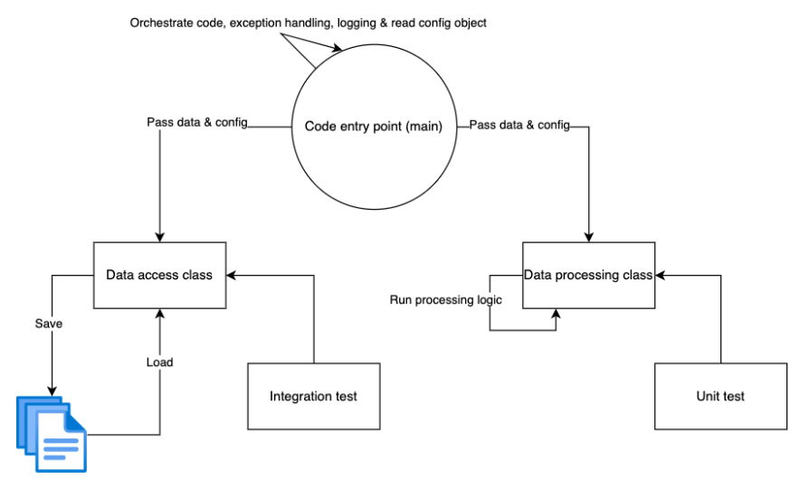

# Programming is communication between people

A lot of people seem to forget this.
Programming is much more an act of communication between you and another programmer, than communication between you and a computer. This "other programmer" could also be you, in 6 months...

It often doesnt matter how you do something exactly, but you need to have an opinion.

- Use git, plus a [convention how to use git](https://www.toptal.com/software/trunk-based-development-git-flow)
- Dont hardcode, use pydantic
- use linters (black / flake8 / mypy)
- use environments (e.g. poetry + pyenv)

Some situations require another approach, but "I have never used it before" is definitely not a good reason not to use it.

It can also help to describe *how* you are going to organise your code.

Again, an example from the `README.md` same project with 6 people:

This tells you:
- Every module should have a `main.py` file as entry point
- Every module should have a Data access class that organizes all data accessing. 
- Every module should have a Data Processing class.

As an example, have a look at the DataHandler classes from both the `ocr` (that reads a pdf and does optical character recognition, outputting text) and the parser (that takes in text and outputs structured data).

You can notice:
- both handle loading and saving data
- both classes have a `generator`, `__len__` and `save` function.
- both classes take a pydantic presets object as input. You should be able to guess by now, in which file you can find those objects...

