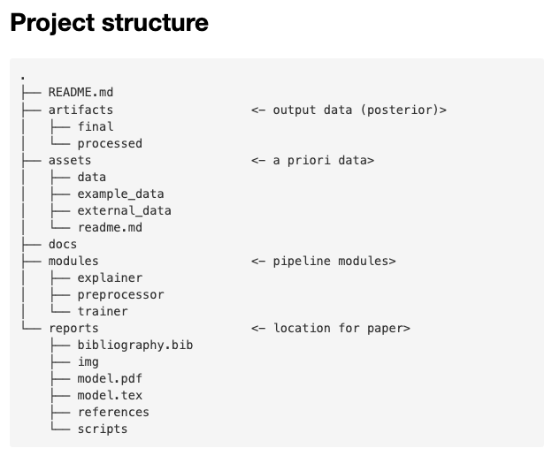
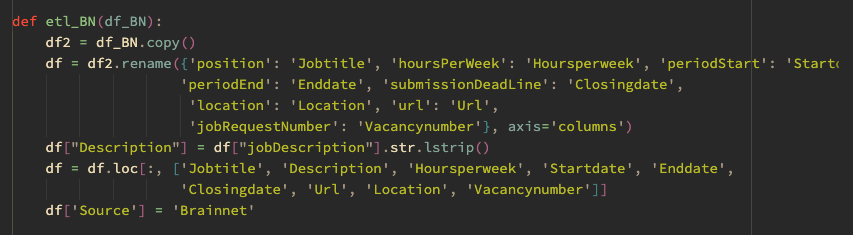

# What is deployment?

## Maintainable code
When is code maintainable?

- How easy is it to understand the code, when you have never seen it (of havent seen it for 6 months)
- How easy is it to change things (e.g. new column names, extra variables, different location of a folder) without breaking everything.

When small changes (can you add an additional feature to your model?) take 2 days, your code is not maintainable.
The structure of your project should tell people where to find things. Organizing a project is essential to keep an overview, especially when working with more people.


### Project structure
It is understandable that your code grows organically during the project. But if your project files look like this, you need to refactor your code.


Where to start with this...
- there are files `scrape_XX.py` and `etl_XX.py`. They contain sort of the same code. This should have been organized in classes; you need a baseclass with code that's the same for every scrape or etl action, and you inherit or compose for every usecase.
- the files give you no clue what the process is. There seems to be some etl and scraping, but what about the `CountingEveryWord.py` and `count_words_vacancy.py` files? Are they part of the same? Do they depend on eachother? During what phase?

During the course I have encouraged you to organize your project structure.
This is an example of a project where we work together with 6 datascientists.



This is much better. There is input data, and output data.
There is a pipeline with three phases. And a location for a paper. A lot is self explanatory.

But there is more: the `README.md` file in this project also gives a visual overview of the process:

It should be much clearer what is going on, and how the logic of the project pipeline corresponds to the modules in the project.

### Organizing functions
If we would take a look in one of the `etl_XX.py` files, we would find this:


Unfortunately for the person that needs to maintain this, every `etl_xx.py` file has some renaming at the start.
This means you will have to search through every file if something changes in the naming convention.
What's even worse: the naming convention could change, because this is the scraping of external websites, so every time an external website changes the naming convention the pipeline might crash...

While the hardcoding is also problematic, the bigger problem is here that it is unclear how every function is connected to other functions. During the course, you have been encouraged to organize your code in classes.


This is better: there is a `DataProcessor` class, and the class has some methods that are connected together.
But this can still be improved. This is a class to process a document. Every document has sections (`deelcontact`, `context`, `bloedwaardes`) and every section has it's own method. 
It turned out that every method is repeating a lot of the same logic. After refactoring the code, we ended up with this:


There are just two functions now: `extract` and `splitter`. This applies the same logic to every section of the document: the section should be extracted, and splitted into subparts.

### Never hardcode, use a settings file

Hardcoding values (like locations to a file, columnnames, default values) throughout your code (like we could see in the `etl_BN.py` example) is very tricky. If something changes, you will end up checking lots and lots of files, searching for every location where a value might have been hardcoded to change the value.

During the course we have encouraged you to gather everything in one `settings.py` file, and use pydantic to organize the settings. The advantage of this is huge: if something changes, you will only have to go to one file (the `settings.py` file) and change the values there.

While using a `settings.py` file is better than hardcoding, things still can go wrong. Compare these two examples:


and


In the first case, you can see a lot of regular expressions. Some of them have a naming convention (Start_, End_) but it turns out that some Start values are also used to End a section, and some values don't follow the Start_ or End_ convention, and it is uncluear what they do, exactly.

In the second example, you should notice immediately that there are sections, and every section has the same values: start, stop, split, symbol and clean. You might also notice how the `stop` value of `probleemlijst` is *almost* the same as the `start` value of `medication`.

This last settings file, while complex, is orders of magnitude easier to maintain than the `etl_XX.py` codebase, but also easier to maintain than the `Regexes` settings.

### Create objects
It is typical for python code to find a function that receives arguments like this:

```python
def parse(values, k):
	...
```

The question now is: what is `values`? A list of values? A numpy-array? A torch-tensor?
And what is `k`? A float? An integer? Does the code still work if `k` is an integer?

You will have to study the code to figure this out.

You have been encouraged to use typehinting:

```python
def parse(values: List[int], k: Optional[str]) -> float:
	...
```

Ah! The `values` are a list of integers, the `k` parameter is optional...

Problem is still: python might happily run if you pass this function a list of floats. 
Your code might give incorrect answers now, but python wont crash because you pass it a float. 

You have been encouraged to create pydantic objects. If you tell pydanctic something should be a float, it will be a float. If you pass it an int, or a string, pydantic will try to parse your value to a float. If it cant do that, it will crash! This is good, because you will find the error at the place where it occurs.

```pyhton
from pydantic import BaseModel
from typing import List
class Values(BaseModel):
	values: List[int]
	k: Optional[str]

def parse(values: Values) -> float:
	...
```

Now it should be clear that a) the function needs a `Values` object, defined by the `Values` class, and you have the guarantee that `values` actually is a List of integers, and `k` is a string or `None`
